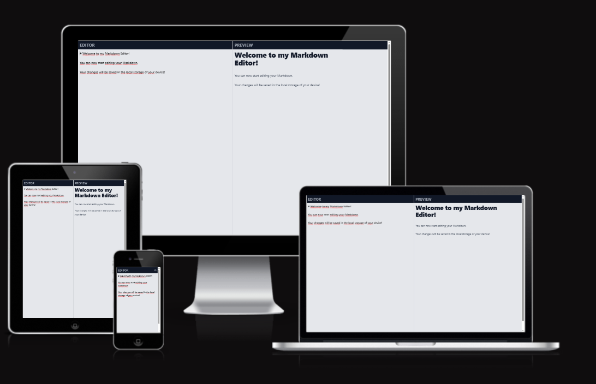
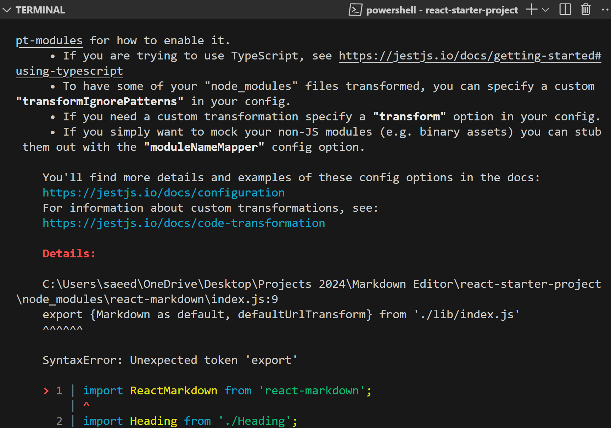

# React Markdown Editor App

This a markdown editor app created by using React Typescript.
The app was deployed using [Netlify](https://www.netlify.com/).

Please find my [Live site](https://as-markdowneditor.netlify.app/) and Github [Repo](https://github.com/aimansae/as-markdown-editor).




- [Prerequisites](#prerequisites)
- [Requirements](#requirements)
- [Additional Requirements](#additional-requirements)
- [Challenges](#challenges)
- [Technologies Used](#technologies-used)
- [Getting Started](#getting-started)
- [Github Setup](#github-setup)
- [Testing and Troubleshooting](#testing-and-troubleshooting)
- [Future Features](#future-features)
- [Resources and Inspiration](#resources-and-inspiration)
## Prerequisites

Tips from my mentor: Before you start with this task, research what Markdown format is.

## Requirements

- Use the starter project, to kick-start your development.
- Create a new repository and push the starter as initial commit.
- Pick a styling solution of your choice. (CSS, SCSS, Modules, Tailwind, Styled components, Emotion)
- Implement the UI. Implement a side by side view. On the left side you enter/edit the markdown. On the right side you see the output which is updated as you type, rendered correctly as valid HTML.
- Keep it simple, it doesn’t have to be fully featured.
- You are allowed to use any library of your choice, which will parse the markdown automatically for you. If you decide not to, and parse it yourself, add support for at least: h1-h6, p, ul > li, strong and `<a>`
- Make sure the design is responsive. On mobile simply show either of the sides and make it switchable via button somewhere.

## Additional requirements

- Create a Github repository.
- Commit your changes regularly.
- Adjust your README.md to explain your project.
- Deploy it to Netlify for free and put the URL in the README.md
- An example app, that’s already existing out there in the world: 
[StackEdit](https://stackedit.io/app)

**Time limit:** 6 hours

## Challenges

1. Understanding react-markdown:
Integrating the react-markdown package wasn’t as straightforward as expected. It took time to understand:
How it parses and safely renders Markdown content as React components
The correct way to pass the input string using {children}:

```bash
<ReactMarkdown>{input}</ReactMarkdown>
```
Styling limitations inside Markdown (prose, prose-a:text-blue-600) and how Tailwind interacts with it

2. Building a Side-by-Side Editor & Preview
Creating a seamless side-by-side Markdown editor and preview panel brought UI and logic challenges:
I had to manage layout responsiveness (especially stacking on mobile)
I implemented a layout that displays the Markdown input on one side and the live rendered preview on the other

3. Toggling Between Editor and Preview
It was tricky to handle state transitions between the editor and preview modes. I used a state flag and conditional rendering to:
- Show/hide the preview or editor
- Allow interaction with an icon button inside the Header component
- Keep the Markdown input in sync with both views

Example:

```bash
<Header onIconClick={onIconClick} mode="preview">
  Preview
</Header> 

```
4. Maintaining Markdown Input Consistency
While switching between views, I had to ensure the Markdown input remained preserved and updated without loss of content or formatting — especially when editing rich content like links, headings, or lists.

## Technologies Used
- [React](https://react.dev/) with [TypeScript](https://react.dev/learn/typescript) – for building reusable UI components and ensuring type safety
- [Vite](https://vite.dev/guide/) – for a fast and modern build setup
- [Tailwind CSS](https://v3.tailwindcss.com/docs/guides/create-react-app) – for utility-first styling and responsive design
- [React Markdown](https://www.npmjs.com/package/react-markdown) – to parse and render Markdown syntax
- [Jest & React Testing Library](https://jestjs.io/docs/tutorial-react) – for writing and running unit tests
- [Netlify](https://app.netlify.com/) – for deployment
- [Prettier + Tailwind Plugin](https://dev.to/tsamaya/eslint-and-prettier-configuration-for-react-project-2gij) – for code formatting and class ordering

## Getting Started

### [Cloning](https://www.youtube.com/watch?v=i8KuDon82KM&ab_channel=h3webdevtuts) from an existing starter project

1. Open VsCode
2. Click on Menu, View, Command Palette (Ctrl+Shift+P)
3. Type Git Clone
4. Paste the Github Link of the Starter project
5. Make sure there a no node_module files
6. In terminal add npm i

## Github Setup

1. Create a local folder and connect it to [Github](https://github.com/)

2. Open github and create new repository - Copy the link and in terminal add:
```bash
git init
git remote remove origin
git remote add origin <your-repo-link>
git add .
git commit -m "Initial commit"
git push -u origin master
```
3. If needed Enter credentials to connect the IDE to Github
4. Resources found on [Youtube](https://www.youtube.com/watch?v=vbQ2bYHxxEA)

### [Tailwind Installation](https://tailwindcss.com/docs/guides/vite)

1. In terminal type:
```bash
   npm install -D tailwindcss postcss autoprefixer
   npx tailwindcss init -p (creates tailwind.config.js file)

2. Configure template paths in tailwind.config.js add:
   content: [ "./index.html", "./src/**/*.{js,ts,jsx,tsx}", ],

3. Add Tailwind directives to index.css

   @tailwind base;
   @tailwind components;
   @tailwind utilities;

4. Order Classes automatically
   npm install -D prettier prettier-plugin-tailwindcss

5. Add plugin in prettierrc file:
   "plugins": ["prettier-plugin-tailwindcss"]

6. [Tailwind Typography plugin](https://tailwindcss.com/docs/plugins#typography)
   npm i -D @tailwindcss/typography

In tailwind.config.css add:
plugins: [require('@tailwindcss/typography')]

### [React markdown package](https://www.npmjs.com/package/react-markdown/v/8.0.6)

npm i react-markdown

### [Testing user event](https://testing-library.com/docs/user-event/install)
npm install --save-dev @testing-library/user-event

```

## Testing and Troubleshooting

- While running npm test encountered error:
ReferenceError: require is not defined in ES module scope, you can use import instead
This file is being treated as an ES module because it has a '.js' file extension and 'C:\Users\saeed\OneDrive\Desktop\Projects 2024\Markdown Editor\react-starter-project\package.json' contains "type": "module". To treat it as a CommonJS script, rename it to use the '.cjs' file extension.

**Fixed**:

Replaced jest.config.js with jest-setup.ts and added:
import '@testing-library/jest-dom'
['<rootDir>/jest-setup.js']
In package.json added after vite:

      "vite": "^5.1.0"


"jest": {
"testEnvironment": "jsdom",
"transform": {
"^.+\\.tsx?$": "ts-jest",
      "^.+\\.(jpg|jpeg|png|gif|svg)$": "<rootDir>/node_modules/jest-transform-stub"
}
},
"include": [
"./jest-setup.ts"
]

- Validation Error:

Module <rootDir>/node_modules/jest-transform-stub in the transform option was not found.
<rootDir> is: C:\Users\saeed\OneDrive\Desktop\Projects
2024\Markdown Editor\react-starter-project

Configuration Documentation:
https://jestjs.io/docs/configuration


**Fixed**

npm install --save-dev jest-transform-stub

make sure to update your package.json to include it as a transform module.  
 transform: {
'^.+\\.jsx?$': 'babel-jest',
    '^.+\\.css$': 'jest-transform-stub', // Add this line for CSS files if needed
},


- While running npm test encountered the followed error


**Fixed** 

Followed Option 1 solution from [Github react-markdown remarks](https://github.com/remarkjs/react-markdown/issues/635#issuecomment-956158474)

In src folder, created __mocks__
directory and within it created a react-markdown.tsx file with:

import React from "react";
interface ReactMarkdownProps {
  children: React.ReactNode;
}
function ReactMarkdown({ children }: ReactMarkdownProps) {
  return <>{children}</>;
}
export default ReactMarkdown;

Created  Jest.config.ts added:
added module.exports = {
  moduleNameMapper: {
    "^react-markdown$": "<rootDir>/src/__mocks__/react-markdown.tsx",
  },
};

### Future Features

- Dark mode toggle
- Save/load markdown drafts from localStorage
- Download markdown as .md file
- Toolbar with formatting buttons (bold, italic, link, heading)
- Live word/character count
- Export as PDF or HTML
- Collaborative editing using WebSockets or Firebase
- Accessibility improvements (screen reader support)

### Resources and Inspiration
- [React Markdown](https://www.npmjs.com/package/react-markdown/v/8.0.6)
- [StackEdit](https://stackedit.io/)
- A special thanks to my mentor Amal K. who guided me through the development process and provided valuable feedback on the project. Your support and insights made a big difference!

 